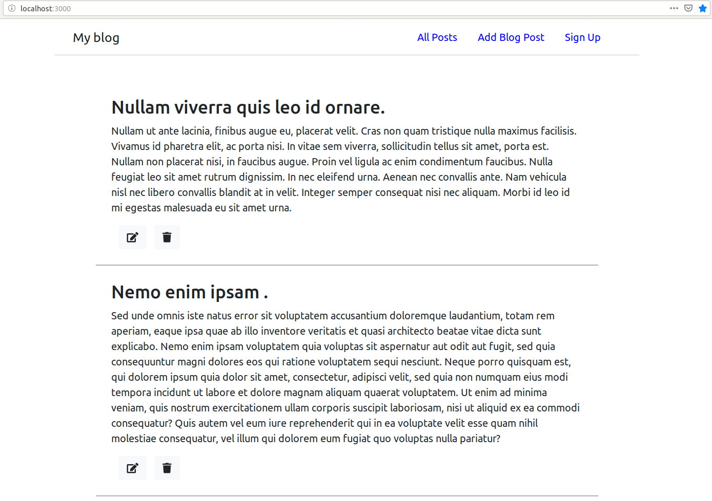

## Simple beginner full stack MongoDB, React, Node and Express (MERN) Blog app ##

### Requirements ###
 * Node.js
 * MongoDB
 
### Installation Steps ###
1. Clone repo
2. Run following commands
   - **npm install (or run with yarn)**   
   - **cd backend && npm install**
   - **cd client && npm install**
   
 App should look like image down below after adding few posts.
   

